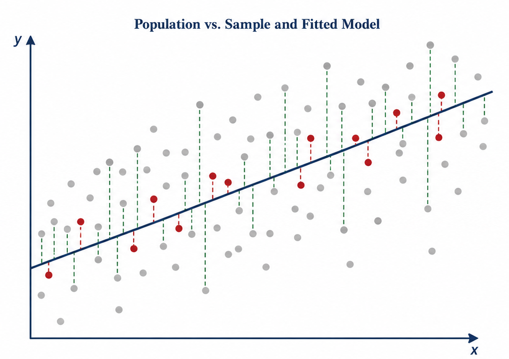
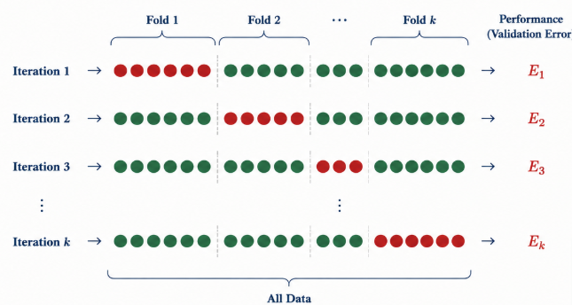
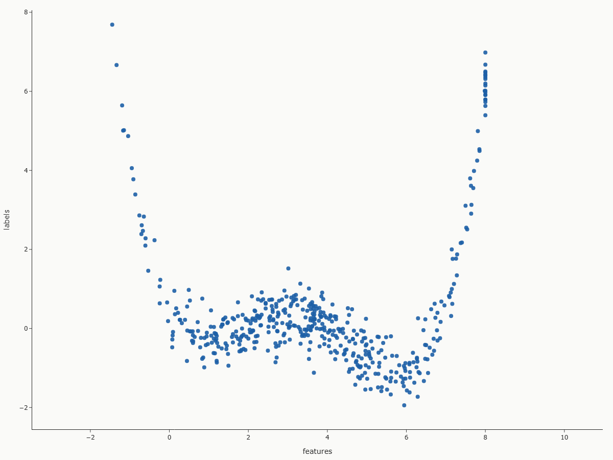
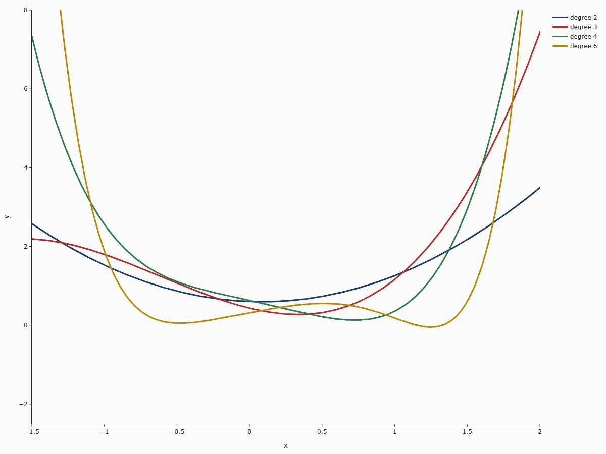
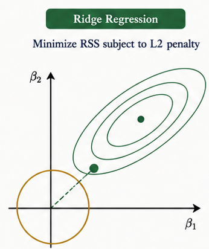
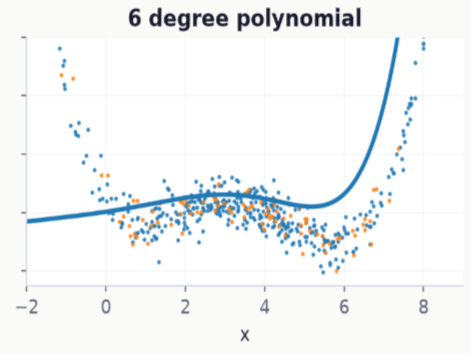
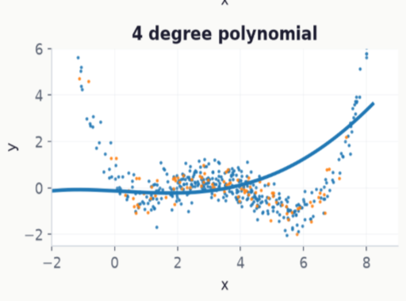

---
project:
  type: website
  output-dir: docs

website:
  title: "Linear Regression — A Deep Learning Perspective"
  subtitle: "Generalization - Regulation"
  author: "Tupac Torres Bartsch"
  date: today

format:
  revealjs:
    slide-number: true
    progress: true
    transition: slide
    transition-speed: fast
    background-transition: fade
    fig-align: center
    navigation-mode: linear

execute:
  cache: true
  jupyter: python3
  echo: false
  warning: false
  message: false

mainfont: Arial
fontsize: 1.05em
---


```{python}
#| include: false
import numpy as np
import matplotlib.pyplot as plt
import matplotlib.patches as mpatches
import matplotlib.patheffects as pe
from matplotlib.gridspec import GridSpec
from matplotlib.patches import FancyArrowPatch, Circle, FancyBboxPatch
from matplotlib.patches import FancyBboxPatch
import warnings
warnings.filterwarnings('ignore')
import math
import pandas as pd
import numpy as np
import torch
from torch import nn
from torch.utils.data import TensorDataset, DataLoader
import matplotlib.pyplot as plt
from sklearn.cluster import KMeans
from sklearn.metrics import silhouette_score
from sklearn.model_selection import KFold
import numpy as np
import plotly.graph_objects as go
import IPython.display 
from IPython.display import HTML


# ── Global aesthetic settings (university light theme) ─────────────────────
BG      = "#fafaf8"        # warm off-white
CARD    = "#f0f2f5"        # soft grey card
ACCENT1 = "#1a3a6b"        # deep navy
ACCENT2 = "#1d5fa6"        # university blue
ACCENT3 = "#b5282a"        # academic red
ACCENT4 = "#2d7a4f"        # forest green
YELLOW  = "#b8860b"        # dark gold
TEXT    = "#1a1a2e"        # near-black
MUTED   = "#5a6272"        # slate grey

plt.rcParams.update({
    "figure.facecolor":  BG,
    "axes.facecolor":    "#ffffff",
    "axes.edgecolor":    "#d0d5dd",
    "axes.labelcolor":   TEXT,
    "xtick.color":       MUTED,
    "ytick.color":       MUTED,
    "text.color":        TEXT,
    "grid.color":        "#d0d5dd",
    "grid.linewidth":    0.6,
    "font.family":       "sans-serif",
    "font.size":         11,
    "axes.titlesize":    13,
    "axes.titleweight":  "bold",
    "lines.linewidth":   2.2,
    "axes.spines.top":   False,
    "axes.spines.right": False,
})
```


## Training Error Generalization Error

::: {.columns}
::: {.column width="44%"}
The Central Tradeoff when fitting the Models lies within In sample Fit, and General Applicapility on similar Data.

- The Errors we observe witin our Training Data we call: "Training Error"
- The Errors that would occure general we call : "Generaliation Error"
- The Generalization Error includes the Training Error
:::

::: {.column width="54%"}

{width=90%}

:::
:::

## Training Error

:::{.columns}
:::{.column width=42%}

- Average of the Training Losses:
$$
{\large
    R_{emp}[X, y, f] = \frac{1}{n} \sum_{i=1}^{n} \color{darkred}{l(x^{(i)},y^{(i)},f(x^{(i)}))}
}%
$$

- in our Case losses are $L(w,b)$ :
$$
{\large
    L(w,b) = \frac{1}{2n}\sum_{i=1}^{n}(w^\intercal x^{(i)}+b - y^{(i)})^2
}%
$$
:::

:::{.column width=42%}

```{python}
#| echo: false
#| fig-height: 4.8

fig, axes = plt.subplots(1, 2, figsize=(5.25, 3.45))
fig.patch.set_facecolor(BG)

ax = axes[0]
ax.set_facecolor('#ffffff')
w_vals = np.linspace(-1, 4, 300)
loss_vals = 0.5 * (w_vals - 2)**2 * 3 + 0.4*(w_vals - 2)**4 * 0.1

ax.plot(w_vals, loss_vals, color=ACCENT1, lw=2.8)
ax.fill_between(w_vals, 0, loss_vals, alpha=0.12, color=ACCENT1)
ax.axvline(2.0, color=ACCENT4, ls="--", lw=1.6, label="$w^* = 2$")
ax.plot(2.0, 0.0, "o", color=ACCENT4, ms=9, zorder=5)

for ww in [-0.5, 0.6, 3.5, 3.0]:
    lw_val = 0.5 * (ww - 2)**2 * 3 + 0.4*(ww-2)**4*0.1
    grad = (ww-2)*3 + 0.4*(ww-2)**3
    ax.annotate("", xy=(ww - 0.35*np.sign(grad), lw_val - 0.08),
                xytext=(ww, lw_val),
                arrowprops=dict(arrowstyle="-|>", color=ACCENT3,
                                lw=1.8, mutation_scale=13))

ax.set_xlabel("Parameter $w$", fontsize=10)
ax.set_ylabel("Loss $\\mathcal{L}(w)$", fontsize=10)
ax.set_title("Convex Loss — 1D", fontsize=11)
ax.legend(fontsize=9.5, facecolor=CARD, edgecolor="#c0c5cc", labelcolor=TEXT)
ax.set_ylim(bottom=-0.3)
ax.grid(True, alpha=0.3)

ax2 = axes[1]
ax2.set_facecolor('#ffffff')
epochs_lr = np.arange(1, 31)
for lr, col, lbl in [(0.01, ACCENT3, "lr=0.01 (slow)"),
                      (0.1,  ACCENT2, "lr=0.10 (good)"),
                      (0.45, YELLOW,  "lr=0.45 (unstable)")]:
    losses_lr = [10 * (1 - lr)**e for e in epochs_lr]
    if lr == 0.45:
        losses_lr = [10 * abs(1 - lr)**e * (1 + 0.3*np.sin(e)) for e in epochs_lr]
    ax2.plot(epochs_lr, losses_lr, color=col, lw=2.3, label=lbl)

ax2.set_xlabel("Epoch", fontsize=10)
ax2.set_ylabel("Training Loss", fontsize=10)
ax2.set_title("Learning Rate Sensitivity", fontsize=11)
ax2.legend(fontsize=9, facecolor=CARD, edgecolor="#c0c5cc", labelcolor=TEXT)
ax2.set_ylim(bottom=0)
ax2.grid(True, alpha=0.3)

fig.tight_layout(pad=1.2)
plt.savefig("fig_loss_lr.png", dpi=140, bbox_inches="tight", facecolor=BG)
plt.show()
```

:::
:::

## Theory: Generalization Error

:::{layout-ncol=2}

::: {.left}

$$
{\large
    R[p,f] = E(x,y) \sim p[L(w,b)]
}%
$$

### Probability of the Data given the Truth ###
- is not observable but the Startingpoint of our Rationale

### likelihood of the Model ###   
- can be understood by the losses of our Model

### Joint: Generalization Error ###
$$
{\Large
    R[p,f] = \int \int \left[ L(w,b) \cdot p(x,y) \right] \mathrm{d}x \mathrm{d}y
}%
$$

:::

```{python}
#|echo: false

# Grid over x and y
xs = np.linspace(-2, 2, 80)
ys = np.linspace(-2, 2, 80)
X, Y = np.meshgrid(xs, ys)

# Simple predictor: f(x) = x
fX = X

# Pointwise loss
loss = (Y - fX) ** 2

# Simple joint density p(x,y) = p(x)p(y)
sigma_x = 1.0
sigma_y = 1.0

px = (1 / np.sqrt(2 * np.pi * sigma_x**2)) * np.exp(-(X**2) / (2 * sigma_x**2))
py = (1 / np.sqrt(2 * np.pi * sigma_y**2)) * np.exp(-(Y**2) / (2 * sigma_y**2))
p_xy = px * py

# Local contribution to expected loss
Z = loss * p_xy

fig = go.Figure(
    data=[
        go.Surface(
            x=X,
            y=Y,
            z=Z,
            colorscale='RdBu',
            reversescale=True,
            showscale=True,
            colorbar=dict(
                thickness=12,
                len=0.65
            )
        )
    ]
)   

fig.update_layout(
    paper_bgcolor="#fafaf8",    
    title=r"",
    scene=dict(
        bgcolor="#fafaf8",
        xaxis_title="x",
        yaxis_title="y",
        zaxis_title="L(w,b) · p(x)",
        camera=dict(
            eye=dict(x=1.6, y=1.6, z=0.9)
        )
    ),
    width=600,
    height=460,
    margin=dict(l=0, r=0, t=0, b=0)
)

# Show in notebook
fig.show()

# Export for Reveal.js
fig.write_html(
    "expected_loss_surface.html",
    include_plotlyjs=True,   # fully self-contained
    full_html=True
)
```

:::

## Cross-Validation

:::{.columns}
:::{.column width=44%}

- The Theory requires, prior knowledge of the True Model
- If we already new the real True Model,why woul w ebuilkd a estimate?
- In Practice we use Crossvalidation to Approximate our Generalization Error

$$
{\large
    E_{CV} = \frac{1}{k} \sum_{i = 1}^{k} Ei 
}%
$$
:::

:::{.column width=52%}

{width=80%}

:::
:::

## Example:

```{python}
#| echo: false
n_train, n_test = 400, 100
max_degree = 8
true_w = torch.zeros(max_degree)
true_w[0:5] = torch.tensor([-0.2, 0.4, 0.4, -1.194, 0.672], dtype=torch.float32)  # cubic truth
```

```{python}
#| echo: false
## Generate features
features = torch.randn(n_train + n_test, 1)   # N(0,1)
features = features * 2.4 + 3.5               # roughly mean 1.5, std 2  (covers ~[-3, 6])
features = torch.clamp(features, -8.0, 8)   # hard truncate to [-3, 6]

perm = torch.randperm(features.shape[0])
features = features[perm]
perm = torch.randperm(features.shape[0])
features = features[perm]

# Center x around the middle of the interval
x0 = 1.5                        # midpoint of [-3,6]
x_centered = features - x0

poly_features = torch.cat(
    [x_centered ** i / math.factorial(i) for i in range(max_degree)],
    dim=1
)

# generate labels from features and truth
labels = poly_features @ true_w
labels += 0.42 * torch.randn_like(labels)

## put them in your working sets
X_train, X_test = poly_features[:n_train], poly_features[n_train:]
y_train, y_test = labels[:n_train], labels[n_train:]
x_train_raw, x_test_raw = features[:n_train], features[n_train:]
```

```{python}
#| echo: false

## get the losses
def evaluate_loss(model, X, y):
    model.eval()
    with torch.no_grad():
        pred = model(X)
        return nn.MSELoss()(pred, y).item()

## fit the model
def fit_polynomial(degree, num_epochs=19, lr=0.0001):
    model = nn.Linear(degree, 1, bias=False)
    loss_fn = nn.MSELoss()
    opt = torch.optim.SGD(model.parameters(), lr=lr)

    ds = TensorDataset(X_train[:, :degree], y_train)
    dl = DataLoader(ds, batch_size=min(10, n_train), shuffle=True)

    train_losses, test_losses = [], []

    for epoch in range(num_epochs):
        model.train()
        for xb, yb in dl:
            opt.zero_grad()
            loss = loss_fn(model(xb), yb)
            loss.backward()
            opt.step()

        train_losses.append(evaluate_loss(model, X_train[:, :degree], y_train))
        test_losses.append(evaluate_loss(model, X_test[:, :degree], y_test))

    return model, train_losses, test_losses
```

::: {.columns}
::: {.column width="44%"}
### We want to estimate a polynomial:

$$
{\large
    Y = \mathcal{P}_d(X) =  \sum_{i=0}^{d} x^i w_i
}%
$$

{width=90%}

:::
::: {.column width="44%"}
### Our Candidates are:

:::{layout-ncol=2}
$$
    \hat{Y} = \mathcal{P}_2(X)    \\    
    \hat{Y} = \mathcal{P}_3(X)    \\    
$$

$$
    \hat{Y} = \mathcal{P}_4(X)    \\    
    \hat{Y} = \mathcal{P}_6(X)    
$$
:::

{width=80%}

:::
:::

## Our Fit gives us that

```{python}
#| echo: false
results = {}
for degree in [3, 4, 5, 7]:
    results[degree] = fit_polynomial(degree)
``` 

::: {.columns}

::: {.column width="74%"}
```{python}
#| echo: false
x_grid = torch.linspace(features.min().item() - 0.2,
                        features.max().item() + 0.2, 400).reshape(-1, 1)
grid_poly = torch.cat(
    [x_grid ** i / math.factorial(i) for i in range(max_degree)],
    dim=1
)

fig, axes = plt.subplots(2, 2, figsize=(9, 6), sharey=True)
axes = axes.ravel()

# Fixed view window, same for all panels
for ax in axes:
    ax.set_xlim(-2.0, 9.0)   # x-range you care about
    ax.set_ylim(-2.5, 6)   # fixed y-range (e.g. just a bit beyond your y extremes)

for ax, degree in zip(axes, [3, 4, 5, 7]):
    model, train_losses, test_losses = results[degree]
    with torch.no_grad():
        y_hat = model(grid_poly[:, :degree]).numpy()

    ax.scatter(x_train_raw.numpy(), y_train.numpy(), s=2, alpha=0.8, label="train")
    ax.scatter(x_test_raw.numpy(), y_test.numpy(), s=2, alpha=0.8, label="test")
    ax.plot(x_grid.numpy(), y_hat, lw=2.5, label=f"degree {degree-1}")
    ax.set_title(f"{degree-1} degree polynomial")
    ax.set_xlabel("x")
    ax.grid(alpha=0.25)

axes[0].set_ylabel("y")
axes[2].set_ylabel("y")
axes[0].legend(frameon=False)
fig.suptitle("Polynomial fitting: underfit vs. good fit vs. overfit", y=0.98)
fig.tight_layout()
plt.show()
```

:::

::: {.column width="24%"}

```{python}
#| echo: false
import pandas as pd
import numpy as np

# Collect all estimated weights
estimated_weights = {}
max_deg = max(results.keys())
max_k = max_deg  # max number of coefficients we ever see

for degree in sorted(results.keys()):
    model, train_losses, test_losses = results[degree]
    w_hat = model.weight.detach().cpu().reshape(-1).numpy()
    estimated_weights[degree] = np.round(w_hat,4)

# ensure consistent ordering of columns
degrees = [3, 4, 5, 7]

# build DataFrame, padding shorter columns with NaN
df = pd.DataFrame(
    {deg: pd.Series(estimated_weights[deg]) for deg in degrees}
)

# set row index as generic weight index (0..max_k-1)
df.index = np.arange(df.shape[0])
df.index.name = "w"

def fmt_trunc(v):
    # If v is NaN, show empty string or 'NaN'
    if isinstance(v, float) and math.isnan(v):
        return ""  # or "NaN"
    # truncate to 4 decimals
    v_trunc = int(v * 10_000) / 10_000.0
    s = f"{v_trunc:.2f}"
    s = s.rstrip("0").rstrip(".")
    return s

styled = (
    df.style
      .format(fmt_trunc)
)

styled
```

:::

:::

## Training Process

Plot the Loss:

```{python}
#| echo: false
fig, axes = plt.subplots(2, 2, figsize=(8, 6), sharey=True)
axes = axes.ravel()

for ax, degree in zip(axes, [3, 4, 5, 7]):
    model, train_losses, test_losses = results[degree]
    ax.plot(train_losses, lw=2, label="train loss")
    ax.plot(test_losses, lw=2, label="test loss")
    ax.set_title(f"{degree-1} degree")
    ax.set_xlabel("epoch")
    ax.set_yscale("log")
    ax.grid(alpha=0.25)

axes[0].set_ylabel("MSE loss (log scale)")
axes[2].set_ylabel("MSE loss (log scale)")
axes[0].legend(frameon=False)

fig.suptitle("Generalization gap by model complexity", y=0.98)
fig.tight_layout()
plt.show()
```

## Cross-Validation

We use K-Fold to Validate our model:

```{python}
#| echo: false
K = 5
n_samples = poly_features.shape[0]
indices = np.arange(n_samples)
np.random.seed(0)  # for reproducibility
np.random.shuffle(indices)

folds = np.array_split(indices, K)
```


```{python}
#| echo: false
def fit_polynomial_on_split(X_all, y_all, train_idx, val_idx, degree,
                            num_epochs=30, lr=0.0001):
    model = nn.Linear(degree, 1, bias=False)
    loss_fn = nn.MSELoss()
    opt = torch.optim.SGD(model.parameters(), lr=lr)

    X_train = X_all[train_idx, :degree]
    y_train = y_all[train_idx]
    X_val   = X_all[val_idx, :degree]
    y_val   = y_all[val_idx]

    ds = TensorDataset(X_train, y_train)
    dl = DataLoader(ds, batch_size=min(10, len(train_idx)), shuffle=True)

    for epoch in range(num_epochs):
        model.train()
        for xb, yb in dl:
            opt.zero_grad()
            loss = loss_fn(model(xb), yb)
            loss.backward()
            opt.step()

    # one validation MSE at the end
    model.eval()
    with torch.no_grad():
        val_pred = model(X_val)
        val_loss = loss_fn(val_pred, y_val).item()

    return model, val_loss
```


```{python}
#| echo: false
degrees = [3, 4, 5, 7]  # or any list you like
cv_results = {deg: [] for deg in degrees}

for degree in degrees:
    for k in range(K):
        val_idx = folds[k]
        train_idx = np.concatenate([folds[j] for j in range(K) if j != k])

        model, val_loss = fit_polynomial_on_split(
            poly_features, labels, train_idx, val_idx, degree
        )
        cv_results[degree].append(val_loss)

print("5-fold cross-validation MSE per degree:\n")
```

:::{layout-ncol=2}
```{python}
#| echo: false
# mean MSE per degree
mean_mse_per_degree = [np.mean(cv_results[d]) for d in degrees]
xm = np.arange(len(degrees))
minloss = min(mean_mse_per_degree)
maxloss = max(mean_mse_per_degree)

# add a small margin (e.g. 5–10%) for plotting
margin = 0.05 * (maxloss - minloss if maxloss > minloss else maxloss)

floor = minloss - margin
top   = maxloss + margin

plt.figure(figsize=(5, 3))
plt.bar(xm, mean_mse_per_degree)
plt.xticks(xm, [d - 1 for d in degrees])   # labels: 2, 3, 4, 6
plt.ylim(floor, top)
plt.xlabel("Polynomial degree")
plt.ylabel("5-fold CV MSE")
plt.grid(alpha=0.3)
plt.title("MEAN SQUARED ERROR via K-fold cross-validation")
plt.show()
```

```{python}
#| echo: false
std_mse_per_degree = [np.std(cv_results[d]) for d in degrees]
xst = np.arange(len(degrees))

stdminloss = min(std_mse_per_degree)
stdmaxloss = max(std_mse_per_degree)

# add a small margin (e.g. 5–10%) for plotting
stdmargin = 0.05 * (stdmaxloss - stdminloss if stdmaxloss > stdminloss else stdmaxloss)

stdfloor = stdminloss - stdmargin
stdtop   = stdmaxloss + stdmargin

plt.figure(figsize=(5, 3))
plt.bar(xst, std_mse_per_degree)
plt.xticks(xst, [d - 1 for d in degrees])
plt.ylim(stdfloor, stdtop)
plt.xlabel("Polynomial degree")
plt.ylabel("5-fold CV StD")
plt.grid(alpha=0.3)
plt.title("StD via K-fold cross-validation")
plt.show()
```
:::


```{python}
#| echo: false
for degree in degrees:
    losses = cv_results[degree]
    mean_loss = np.mean(losses)
    std_loss = np.std(losses)
    print(f"degree {degree-1}: mean MSE={mean_loss:.4f}, std={std_loss:.4f}")
```

## Check Your Understanding {background-color="#fafaf8"}

::: {style="display:grid; grid-template-columns:1fr 1fr; gap:1.1rem; margin-top:1rem;"}

::: {.fragment .fade-up}
::: {style="background:#f0f2f5; border-top:4px solid #1a3a6b; border-radius:8px; padding:1.1rem;"}
**1. IID-Errors**

Give at least five examples where dependent random variables make treating the problem as IID data inadvisable.
:::
:::

::: {.fragment .fade-up}
::: {style="background:#f0f2f5; border-top:4px solid #b5282a; border-radius:8px; padding:1.1rem;"}
**2. k-fold**

Why is the k-fold cross-validation very expensive to compute?

:::
:::

::: {.fragment .fade-up}
::: {style="background:#f0f2f5; border-top:4px solid #2d7a4f; border-radius:8px; padding:1.1rem;"}
**3. Zero Errors**

Can you ever expect to see zero training error? Under which circumstances would you see zero generalization error?

:::
:::

::: {.fragment .fade-up}
::: {style="background:#f0f2f5; border-top:4px solid #b8860b; border-radius:8px; padding:1.1rem;"}
**4. Complexity**

The VC dimension is defined as the maximum number of points that can be classified with arbitrary labels 
by a function of a class of functions. Why might this not be a good idea for measuring how complex the class of functions is? Hint: consider the magnitude of the functions.

:::
:::

:::

## Part 5: Generalization, Regulations {background-color="#1a3a6b"}

::: {style="display:flex; flex-direction:column; align-items:center; justify-content:center; height:72vh; gap:1rem;"}

::: {style="font-size:2.2rem; font-weight:800; color:#ffffff; text-align:center; font-family:'Inter',sans-serif;"}
Weigt Decay
:::

::: {style="color:#c5d4e8; font-size:1rem; text-align:center; font-style:italic;"}
Rige Penalty in th Deep learning Context
:::

:::


## Weight Decay

:::{.columns}
:::{.column width=52%}
To mitigate complexity we feed the Optimizer also a penalty for Magintude of weights:

### The Ridge Penalty
$$
{\large
  min[L(w,b) + \color{darkred}{\frac{\lambda}{2} w^2}]
}%
$$

We embed the penalty in the Minibatch optimization process:

$$
{\large
w \leftarrow (1-\eta \color{darkred}{\lambda}) \color{darkred}{w} - \frac{\eta}{|\mathcal{B}|} \sum_{i \in \mathcal{B}} x{(i)} (w^\intercal w{(i)} + b - y^{(i)})
}%
$$

Ridge does not only Reduce complexity, it also allows complexer models to more controlled results.

- Typical Ranges: $10^3 > \lambda > 10^-3$
:::

:::{.column width=42%}

{width=100%}

:::
:::

## In Our Example

```{python}
#| echo: false
def fit_polynomial_on_split(X_all, y_all, train_idx, val_idx, degree,
                            num_epochs=30, lr=0.0002, wd=0.0):
    model = nn.Linear(degree, 1, bias=False)
    loss_fn = nn.MSELoss()
    opt = torch.optim.SGD(model.parameters(), lr=lr, weight_decay=wd)

    X_train = X_all[train_idx, :degree]
    y_train = y_all[train_idx]
    X_val   = X_all[val_idx, :degree]
    y_val   = y_all[val_idx]

    ds = TensorDataset(X_train, y_train)
    dl = DataLoader(ds, batch_size=min(10, len(train_idx)), shuffle=True)

    train_losses = []
    val_losses = []

    for epoch in range(num_epochs):
        model.train()
        for xb, yb in dl:
            opt.zero_grad()
            loss = loss_fn(model(xb), yb)
            loss.backward()
            opt.step()

        model.eval()
        with torch.no_grad():
            train_pred = model(X_train)
            val_pred   = model(X_val)

            train_loss = loss_fn(train_pred, y_train).item()
            val_loss   = loss_fn(val_pred, y_val).item()

        train_losses.append(train_loss)
        val_losses.append(val_loss)

    return model, train_losses, val_losses
```

```{python}
#| echo: false
K = 5
degrees = [3, 4, 5, 7]
lambdas = [1e-3, 1e-2, 1e-1, 2e-1]

cv_results = {deg: {wd: [] for wd in lambdas} for deg in degrees}
loss_paths = {deg: {wd: None for wd in lambdas} for deg in degrees}
best_models = {deg: {wd: None for wd in lambdas} for deg in degrees}

for degree in degrees:
    for wd in lambdas:
        best_loss = float("inf")

        for k in range(K):
            val_idx = folds[k]
            train_idx = np.concatenate([folds[j] for j in range(K) if j != k])

            model, train_losses, val_losses = fit_polynomial_on_split(
                poly_features, labels,
                train_idx, val_idx,
                degree,
                num_epochs=30, lr=0.0001, wd=wd
            )

            final_val_loss = val_losses[-1]
            cv_results[degree][wd].append(final_val_loss)

            if final_val_loss < best_loss:
                best_loss = final_val_loss
                best_models[degree][wd] = model
                loss_paths[degree][wd] = (train_losses, val_losses)
```

```{python}
#| echo: false
fig, axes = plt.subplots(4, 4, figsize=(2.4*len(lambdas), 1.7*len(degrees)), sharex=True, sharey=True)
axes = np.array(axes)

for i, degree in enumerate(degrees):
    for j, wd in enumerate(lambdas):
        ax = axes[i, j]
        train_losses, val_losses = loss_paths[degree][wd]

        ax.plot(train_losses, lw=2, label="train loss")
        ax.plot(val_losses, lw=2, label="val loss")

        ax.set_title(rf"$\lambda = {wd}$")
        ax.set_yscale("log")
        ax.grid(alpha=0.25)

        if i == len(degrees) - 1:
            ax.set_xlabel("epoch")

        if j == 0:
            ax.set_ylabel(f"{degree-1} degree\nMSE loss")

axes[0, 0].legend(frameon=False, fontsize=9)
fig.suptitle("Loss paths by polynomial degree and weight decay", y=0.995)
fig.tight_layout()
plt.show()
```

## Fitted Lines in our Example:
```{python}
#| echo: false
def fit_polynomial_on_split(X_all, y_all, train_idx, val_idx, degree,
                            num_epochs=30, lr=0.0002, wd=0.0):
    model = nn.Linear(degree, 1, bias=False)
    loss_fn = nn.MSELoss()

    # This line implements the update rule from the chapter:
    # it minimizes L(w,b) + (lambda/2)||w||^2
    opt = torch.optim.SGD(model.parameters(), lr=lr, weight_decay=wd)

    X_train = X_all[train_idx, :degree]
    y_train = y_all[train_idx]
    X_val   = X_all[val_idx, :degree]
    y_val   = y_all[val_idx]

    ds = TensorDataset(X_train, y_train)
    dl = DataLoader(ds, batch_size=min(10, len(train_idx)), shuffle=True)

    for epoch in range(num_epochs):
        model.train()
        for xb, yb in dl:
            opt.zero_grad()
            loss = loss_fn(model(xb), yb)
            loss.backward()
            opt.step()

    model.eval()
    with torch.no_grad():
        val_pred = model(X_val)
        val_loss = loss_fn(val_pred, y_val).item()

    return model, val_loss
```

```{python}
#| echo: false
K = 5
# folds = np.array_split(indices, K)   # you already defined this earlier
degrees = [3, 4, 5, 7]
lambdas = [1e-3, 1e-2, 1e-1, 2e-1]  # e.g. no WD, mild WD, stronger WD

cv_results = {deg: {wd: [] for wd in lambdas} for deg in degrees}
best_models = {deg: {wd: None for wd in lambdas} for deg in degrees}


for degree in degrees:
    for wd in lambdas:
        best_loss = float("inf")
        for k in range(K):
            val_idx = folds[k]
            train_idx = np.concatenate([folds[j] for j in range(K) if j != k])

            model, val_loss = fit_polynomial_on_split(
                poly_features, labels,
                train_idx, val_idx,
                degree,
                num_epochs=30, lr=0.0001, wd=wd
            )
            cv_results[degree][wd].append(val_loss)

        if val_loss < best_loss:
            best_loss = val_loss
            best_models[degree][wd] = model

tables = {}  # degree -> DataFrame

for degree in degrees:
    rows = []
    for wd in lambdas:
        mean_loss = np.mean(cv_results[degree][wd])
        rows.append({"λ": wd, "MSE": mean_loss})
    df_deg = pd.DataFrame(rows)
    tables[degree] = df_deg
```

:::{layout="[[6,1]]"}
```{python}
#| echo: false
x_all = x_centered.cpu().numpy()  # original 1D inputs, shape (N,)
y_all = labels

x_plot = np.linspace(x_all.min(), x_all.max(), 200)
x_plot_centered = torch.tensor(x_plot, dtype=torch.float32).view(-1, 1)

X_plot_poly = torch.cat(
    [x_plot_centered ** i / math.factorial(i) for i in range(max_degree)],
    dim=1
)

fig, axes = plt.subplots(
    nrows=len(degrees),
    ncols=len(lambdas),
    figsize=(2.4*len(lambdas), 1.7*len(degrees)),
    
    sharex=True, sharey=True
)

for i, degree in enumerate(degrees):
    for j, wd in enumerate(lambdas):
        ax = axes[i, j]
        model = best_models[degree][wd]

        with torch.no_grad():
            y_hat = model(X_plot_poly[:, :degree]).numpy()

        ax.scatter(x_all, y_all.numpy(), s=1, alpha=0.8)
        ax.plot(x_plot, y_hat, color="red")

        ax.tick_params(axis="both", which="major", labelsize=8)

# column headers (lambdas) – put on top row
for j, wd in enumerate(lambdas):
    axes[0, j].set_title(rf"$\lambda={wd}$")

# row headers (degrees) – use ylabels or fig-side text
for i, degree in enumerate(degrees):
    # option A: use y-axis label
    axes[i, 0].set_ylabel(rf"$\deg={degree-1}$")

    # or option B: text in the left margin
    # fig.text(0.04, 
    #          axes[i, 0].get_position().centery,
    #          rf"deg={degree}", va="center", ha="right")

plt.tight_layout()
plt.ylim(-2, 8)
plt.xlim(-3.5, 7.5)
plt.show()
```

:::{.right}

K-Fold

```{python}
#| echo: false
tables[3].style.hide(axis="index")
```

<br><br>

```{python}
#| echo: false
tables[4].style.hide(axis="index").hide(axis="columns")
```

<br><br>

```{python}
#| echo: false
tables[4].style.hide(axis="index").hide(axis="columns")
```

<br><br>

```{python}
#| echo: false
tables[7].style.hide(axis="index").hide(axis="columns")
```
:::
:::

## Check Your Understanding {background-color="#fafaf8"}

::: {style="display:grid; grid-template-columns:1fr 1fr; gap:1.1rem; margin-top:1rem;"}

::: {.fragment .fade-up}
::: {style="background:#f0f2f5; border-top:4px solid #1a3a6b; border-radius:8px; padding:1.1rem;"}
**1. Optimal Set?**

Use a validation set to find the optimal value of 
. Is it really the optimal value? Does this matter?
:::
:::

::: {.fragment .fade-up}
::: {style="background:#f0f2f5; border-top:4px solid #b5282a; border-radius:8px; padding:1.1rem;"}
**2. The `1/2` factor**

Review the relationship between training error and generalization error. In addition to weight decay, increased training, and the use of a model of suitable complexity, what other ways might help us deal with overfitting?
:::
:::

::: {.fragment .fade-up}
::: {style="background:#f0f2f5; border-top:4px solid #2d7a4f; border-radius:8px; padding:1.1rem;"}
**3. Forgetting `zero_grad()`**

We know that 
. Can you find a similar equation for matrices
:::
:::

::: {.fragment .fade-up}
::: {style="background:#f0f2f5; border-top:4px solid #b8860b; border-radius:8px; padding:1.1rem;"}
**4. One-line swap**

What would the update equations look like if instead of 
 we used 
 as our penalty of choice (
 regularization)?
:::
:::

:::

## Which one is it? ##

### Candidates

$$
{\large
    \hat{y} = \mathcal{P}_2(X), 
}%    \\    
{\large
    \hat{y} = \mathcal{P}_3(X), 
}%    \\    
{\large
    \hat{y} = \mathcal{P}_4(X), 
}%    \\    
{\large
    \hat{y} = \mathcal{P}_6(X),     
}%
$$

### True Model

$$
{\Large
    y =  - 1.5 + \color{darkred}{0.4} x + \color{darkred}{0.2} x^\color{darkred}{2} - \color{darkred}{0.199} x^\color{darkred}{3} + \color{darkred}{0.028} x^\color{darkred}{4}     \\     
}%
$$

### Though In Practice ###

Other models can serve a better Purpose than the truly specified one
$$
{\large
    \hat{y}_6 = \mathcal{P}_6(X) \succ \hat{y}_4 = \mathcal{P}_4(X)    \\    
}%
$$

:::{.columns}
:::{.column width=48%}

{width=70%}

:::

:::{.column width=48%}

{width=70%}

:::
:::

##  {background-color="#1a3a6b"}

::: {style="display:flex; flex-direction:column; align-items:center; justify-content:center; height:72vh; gap:1rem;"}

::: {style="font-size:2.2rem; font-weight:800; color:#ffffff; text-align:center; font-family:'Inter',sans-serif;"}
Takeaway
:::

::: {style="color:#c5d4e8; font-size:1rem; text-align:center; font-style:italic;"}
Put it in your Bag
:::

:::

## Takeaway ##

1. Training error Refers to in Sample Data, Generalization Error to all possible observable Data
2. The True generalization error is not Observable , we Approximate it wire Crossvalidation
3. To acheive well General Performance we aim to mitigate Model Complexity
4. In Deep learning we Approach this by **Weight Decay**
5. We used the Ridge - Penalty for weight decay in our linear Regression 
6. The Bets model also depends on your Objective.